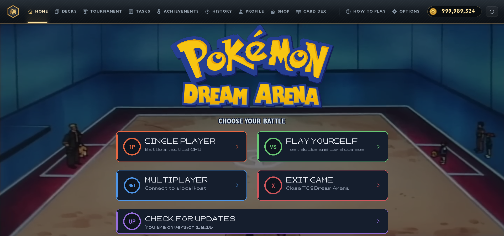
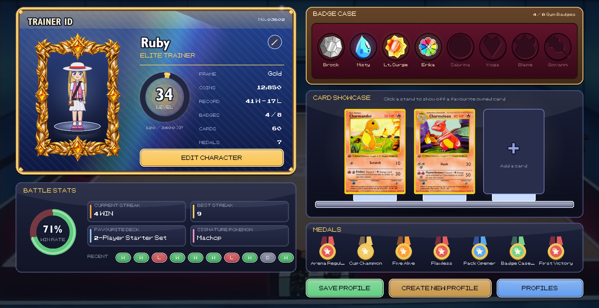
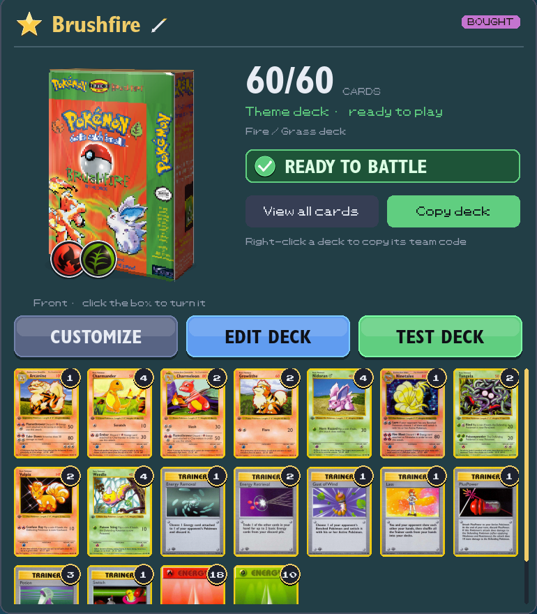
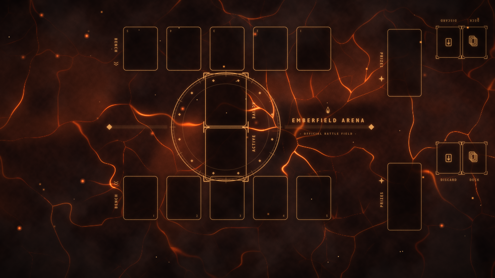
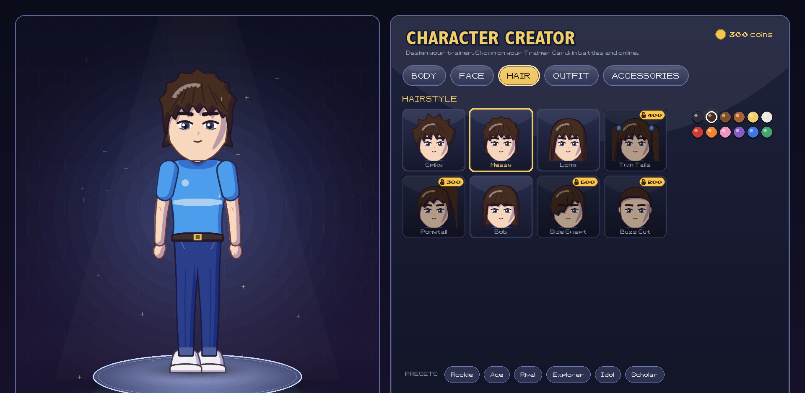

  
 

# TCG Dream Arena

**A fan-made, classic-era Pokémon Trading Card Game for Windows.**
Battle the CPU, take on the Gym Leaders, open booster packs, build decks,
and play your friends online.

---

## ⬇️ Install

1. **[Download the installer](https://github.com/pavlesuto-private/TCG-Dream-Arena-Releases/releases/latest/download/TCG-Dream-Arena-Setup.exe)** (Windows 10/11, about 280 MB).
2. Run it and pick where to install. A shortcut appears on your Desktop.
3. Play!

> Windows SmartScreen may warn about an "unrecognised app" because the
> installer isn't code-signed. Click **More info → Run anyway**.

### Updates are automatic
From version 1.9.10, the game checks for updates by itself. When a new
version is out, the **Check for Updates** tab on the home screen turns gold.
Click it and the game downloads the update, checks it, installs it and
restarts. **Your saves, collection and decks are never touched.**

Already have an older version without in-game updates? Run the installer
above once. It updates in place and keeps your saves.

---

## 🎮 What you can do

| | |
|---|---|
| ⚔️ **Single player** | Battle a tactical CPU at several difficulties. |
| 🏅 **Gym Leader Challenge** | Beat the Gym Leaders with their themed decks and earn badges. |
| ⚡ **Quick Challenge** | One-off battles with twists: fewer Prizes, Sudden Death, Fast Energy, Random Stadium, Type Clash and more. Win coins and cards (3 rewarded wins a day). |
| 🌐 **Multiplayer** | A server browser like the classic shooters: save favourite servers, see open rooms, create public or private rooms with your own rules, join with a click or a code, or spectate a match in progress. |
| 🏆 **Tournaments** | Bracket tournaments with entry fees and growing prizes. |
| 🃏 **Collection & Card Dex** | Collect the classic sets, plus promos. Sort, filter and inspect every card. |
| 🛒 **Shop & packs** | Earn coins by playing and spend them on booster packs, theme decks and singles. |
| 🧰 **Decks** | 3D deck boxes with real cover art, favourites, clear "deck invalid" reasons, a full deck builder and test draws. Share decks with team codes. |
| 🎯 **Tasks, achievements & profile** | Weekly tasks, achievements, avatar frames that level up with you, match history, win streaks. |
| 🧪 **Play yourself** | Control both sides to test decks and card combos. |
| 🧑‍🎤 **Character Creator** | Design your own anime-style trainer (male or female): hair, outfits, caps, accessories. Unlock extra wardrobe items with coins. |
| 🪪 **Trainer Card** | A holo Trainer ID with your level, a badge case for Gym badges, a showcase for your 3 favourite cards, stats and medals. |
| 🖼️ **Level frames** | 11 hand-painted portrait frames from Trainer to Legendary, plus glowing prestige tiers. |
| 🎴 **Playmats** | 21 animated, full-screen playmats: lava, ocean, forest, lightning, cosmic, marble and classic felt. |
| 📦 **Pack opening** | Pull across the top of a pack to tear it open; Rare Holo pulls get a special holo reveal. |

### Faithful rules
The game follows the original-era rules closely, including tricky cards:
Pokémon Powers (Rain Dance, Damage Swap, Muk's Toxic Gas), Dark Pokémon,
Stadiums like Narrow Gym, Ditto's Transform, Brock's Protection, Koga's
Ninja Trick and many more. Every card's attacks and effects are covered by
an automated test suite with hundreds of tests.

---

## 🌐 Playing with friends

1. Open **Multiplayer** and add the host's server to your **favourites**
   (IP, or IP:port). It shows whether the server is online, its ping and
   how many rooms are open.
2. **Create a room**: choose Standard or Custom rules, public or private,
   and your deck. Private rooms get a short code to share.
3. **Join** a waiting room with one click, or type a friend's code.
   In a Custom room you see the rules and accept them before anything is dealt.
4. Rooms already playing can be **spectated**. Spectators can never see
   hands, Prize cards or deck order.

Everyone needs the same game version to play together. If yours is too old,
the game offers to update right there.

---

## 💾 Your data

- Saves live in `%APPDATA%\TCGDreamArena` on your PC. Nothing is uploaded.
- Updates and reinstalls keep your profile, collection and decks.
- If the game ever crashes, a report is saved to the game's `logs` folder.
  Send the newest `crash_*.log` to the developer to get it fixed.

---

## ❓ FAQ

**Is this an official Pokémon product?**
No. It's a non-commercial fan project. Pokémon and all related names and
artwork are trademarks of Nintendo, Creatures Inc. and GAME FREAK inc.

**Does it cost anything?**
No. There are no payments; coins are earned only by playing.

**Mac or Linux?**
Only Windows installers are published here.

---

Made with ❤️ for friends who miss the original TCG.

